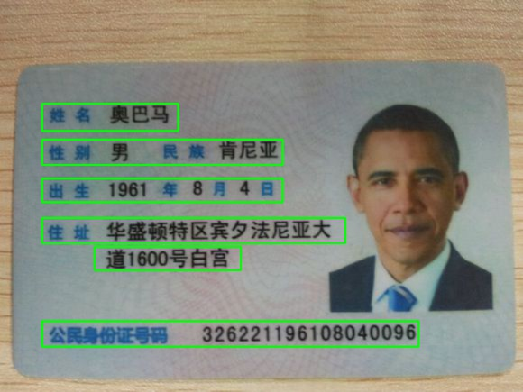
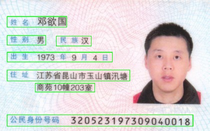
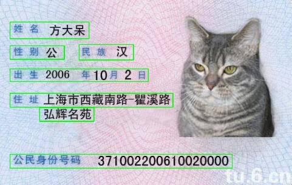
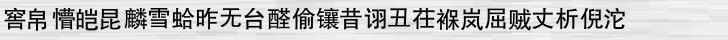
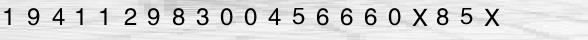
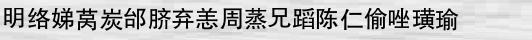
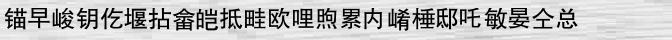

# 身份证识别
---
## 检测

### 方案一（目前使用方案）
 1. 通过mser算法检测roi区域
 *  提取图像的MSER特征区域
 *  以像素离心率为置信度使用nms对bounding box进行挑选
 2. 使用cnn对检测出的roi区域做二分类（有效文字区域和非有效区域）
 *  cnn网络在minist网络上加了一层3x3卷积层和2x2最大池化层
 *  训练集为自动合成的数据，测试集为mser算法在真实身份证上提取的roi区域
 *  训练效果目前较好，在测试集上最高达到100%，loss最小为9*10^-9

### 方案二（效果较好）
直接使用ctpn + fast-rcnn检测文字区域, 项目地址：[text-detection-ctpn](https://github.com/eragonruan/text-detection-ctpn)

目前本地跑的结果（测试图片来自搜索引擎）：

---
## 识别
### 方案一 
 1. 对有效文字区域进行字符分割
 2. 使用cnn进行分类识别
 3. 使用bounding box对文字位置进行还原

### 方案二 （模型训练周期较长）
直接利用rnn对整个句子进行识别（lstm + ctc）

#### 数据集制作
随机自动生成：

